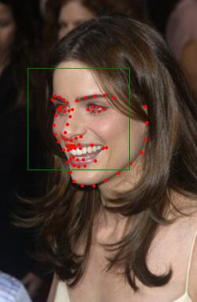
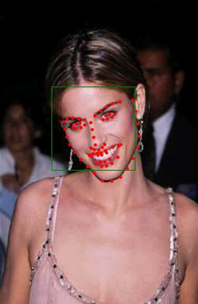
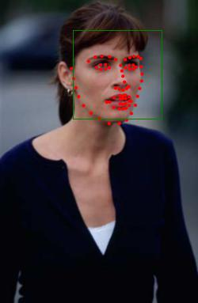

# CPM for facial landmark detection

## Introduction
This is a pytorch version of Convolutional Pose Machines for facial landmarks detection,you can find more details in original paper for [Convolutional Pose Machines](https://arxiv.org/pdf/1602.00134.pdf)

## Results



## Requirements
- Python3.5
- Pytorch 0.4.0
- torchvision

## Dataset Preparation
The raw dataset should be put into the `datasets` folder. 

### Dataset Format
Each dataset is saved as one file, in which each row indicates one specific face in one image or one video frame.
The format of one line : 
```
image_path annotation_path x1 y1 x2 y2 (face_size)
```
- *image_path*: the image  file path of that face.
- *annotation_path*: the annotation file path of that face (annotation is the coordinates of all landmarks)
- *x1, y1, x2, y2*: the coordinates of left-upper and right-lower points of the face bounding box.
- *face_size*: an optional item. If set this value, we use the `face_size` to compute the NME; otherwise, we use the distance between two pre-defined points to compute the NME.

### [300-W](https://ibug.doc.ic.ac.uk/resources/300-W/)

#### Download
- 300-W consits of several different datasets
- Create directory to save images and annotations: mkdir ./datasets/300W
- To download i-bug: https://ibug.doc.ic.ac.uk/download/annotations/ibug.zip
- To download afw: https://ibug.doc.ic.ac.uk/download/annotations/afw.zip
- To download helen: https://ibug.doc.ic.ac.uk/download/annotations/helen.zip
- To download lfpw: https://ibug.doc.ic.ac.uk/download/annotations/lfpw.zip
- To download the bounding box annotations: https://ibug.doc.ic.ac.uk/media/uploads/competitions/bounding_boxes.zip
- In the folder of `./datasets/300W`, there are four zip files ibug.zip, afw.zip, helen.zip, and lfpw.zip
```
unzip ibug.zip -d ibug
mv ibug/image_092\ _01.jpg ibug/image_092_01.jpg
mv ibug/image_092\ _01.pts ibug/image_092_01.pts

unzip afw.zip -d afw
unzip helen.zip -d helen
unzip lfpw.zip -d lfpw
unzip bounding_boxes.zip ; mv Bounding\ Boxes Bounding_Boxes
```
The 300W directory is in `./datasets/300W` and the sturecture is:
```
.
├── afw
├── afw.zip
├── Bounding_Boxes
├── bounding_boxes.zip
├── helen
├── helen.zip
├── ibug
├── ibug.zip
├── lfpw
└── lfpw.zip
```
Then you use the script to generate the 300-W list files.
```
python generate_300W.py
```
All list files will be saved into `./datasets/300W_lists`. The files `*.DET` use the face detecter results for face bounding box. `*.GTB` use the ground-truth results for face bounding box.

#### can not find the `*.mat` files for 300-W.
The download link is in the official [300-W website](https://ibug.doc.ic.ac.uk/resources/300-W).
```
https://ibug.doc.ic.ac.uk/media/uploads/competitions/bounding_boxes.zip
```
The zip file should be unzipped, and all extracted mat files should be put into `./datasets//300W/Bounding_Boxes`.

### [AFLW](https://www.tugraz.at/institute/icg/research/team-bischof/lrs/downloads/aflw/)
download AFLW datasets from the official website,you can alse download it from my baiduyun 
[aflw-images-0.tar.gz --Baiduyun Password: oi38 ](https://pan.baidu.com/s/1RM9BK2fBVfq-q8WhxM8HuA)
[aflw-images-2.tar.gz --Baiduyun Password: u39h ](https://pan.baidu.com/s/1z4qeeC0p0dcoJIwB060idA)
[aflw-images-3.tar.gz --Baiduyun Password: ka2b ](https://pan.baidu.com/s/1hDzDg5W2S04wBU4zRCz5RA)

Download the AFLW datasets in `datasets/AFLW` and extract it by `tar xzvf aflw-images-*.tar.gz`.
```
mv aflw/data/flickr/0 images/
mv aflw/da1ta/flickr/2 images/
mv aflw/data/flickr/3 images/
```
Download the [AFLWinfo_release.mat](http://mmlab.ie.cuhk.edu.hk/projects/compositional/AFLWinfo_release.mat) from [this website](http://mmlab.ie.cuhk.edu.hk/projects/compositional.html) into `./cache_data`. This is the revised annotation of the full AFLW dataset.
put AFLWinfo_release.mat file in `datasets/AFLW` folder, and he structure of AFLW is:
```
.
├── AFLWinfo_release.mat
└── images
    ├── 0
    ├── 2
    └── 3
```
use follow script to generate the AFLW dataset list file into `./datasets/AFLW_lists`.
```
python generate_AFLW.py
```

## Train and Eval
set the training parameter in configs/Detector.config ,configs/SGD.config and script/300W-DET.sh

```
bash script/300W-DET-TRAIN.sh  #for trainning 300W

bash script/AFLW-DET-TRAIN.sh  #for trainning AFLW

ash script/300W-DET-EVAL.sh  #for evaluating 300W

bash script/AFLW-DET-EVAL.sh  #for evaluating AFLW
```


## visualize

Pre-trained model which trained on 300W datasets can be downloaded from here [300W_cpm_vgg16-epoch-049-050.pth --Baiduyun Password: k9c1 ](https://pan.baidu.com/s/1IbeqtyVcErWnQ7ARALv3Lw)
Pre-trained model which trained on AFLW datasets can be downloaded from here [AFLW_cpm_vgg16-epoch-049-050.pth --Baiduyun Password: pd7j ](https://pan.baidu.com/s/18bMLswPCl9a-_vG9c_7rCA)
```
python ./demo.py --model cpm_vgg16-epoch-049-050.pth --image datasets/images/image_0019.png
```
## Note
the repository is based on this [repo](https://github.com/facebookresearch/supervision-by-registration) 